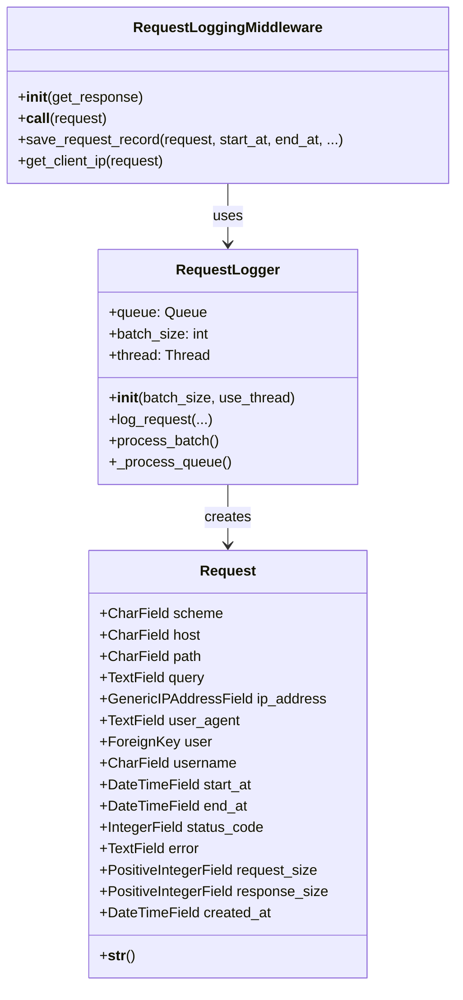
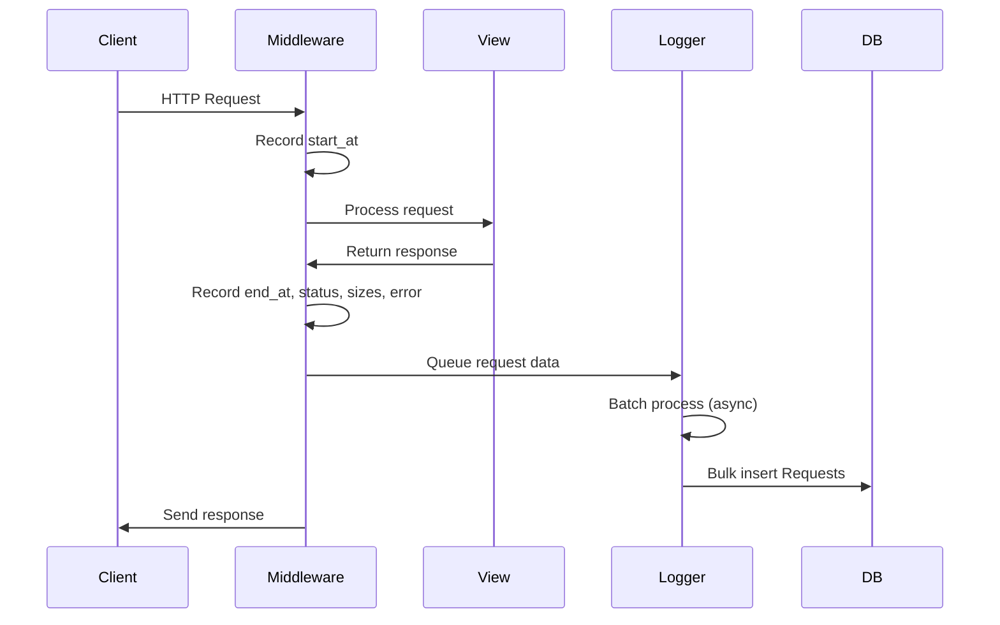

# 📊 Numenor Monitor

A comprehensive Django application for monitoring and logging HTTP requests in your web application. Built with asynchronous logging to minimize performance impact, it captures detailed metrics for analysis and debugging. 🚀

## ✨ Features

- 🔍 **Request Logging**: Automatically logs every HTTP request with full details.
- ⚡ **Asynchronous Processing**: Uses threading and queues for non-blocking DB writes.
- 📈 **Rich Metrics**: Captures URL components, user info, timestamps, response codes, sizes, and errors.
- 🛠️ **Easy Integration**: Middleware-based, plug-and-play with Django.
- 📊 **Batch Inserts**: Efficient DB writes with configurable batch sizes.
- 🧪 **Thorough Testing**: 100% test coverage with Django's test suite.
- 🔒 **Secure**: Handles user data safely with proper null handling.

## 🏗️ Architecture

### 🗂️ Project Structure

```
numenor-monitor/
├── manage.py
├── project/
│   ├── __init__.py
│   ├── asgi.py
│   ├── settings.py          # Django settings with middleware config
│   ├── test_views.py        # Test views for demo purposes
│   ├── urls.py              # URL routing
│   └── wsgi.py
├── numenor_monitor/
│   ├── __init__.py
│   ├── apps.py
│   ├── middlewares.py       # RequestLoggingMiddleware and RequestLogger
│   ├── migrations/          # DB migrations
│   ├── models.py            # Request model
│   ├── tests.py             # Unit tests
│   └── urls.py
├── db.sqlite3               # Default SQLite DB (for dev)
├── pyproject.toml           # Poetry dependencies
├── pdm.lock                 # PDM lock file
└── README.md
```

### 🏛️ Class Diagram



### 🔄 Sequence Diagram



## 🚀 Installation

### Prerequisites
- Python >=3.13
- Django >=6.0
- PDM for dependency management

### Dependencies

**Runtime Dependencies:**
- Django >=6.0

**Development Dependencies:**
- pre-commit >=4.5.1
- coverage >=7.13.1
- django-stubs >=5.2.8

### Setup
1. **Clone the repo**:
   ```bash
   git clone https://github.com/your-repo/numenor-monitor.git
   cd numenor-monitor
   ```

2. **Install dependencies** (using PDM):
   ```bash
   pdm install
   ```

3. **Run migrations**:
   ```bash
   python manage.py migrate
   ```

4. **Configure middleware** in `project/settings.py`:
   ```python
   MIDDLEWARE = [
       # ... other middlewares
       'numenor_monitor.middlewares.RequestLoggingMiddleware',
   ]
   ```

5. **Start the server**:
   ```bash
   python manage.py runserver
   ```

## 📦 Package Distribution

The installable package is `numenor_monitor/` only. The root-level files (`manage.py`, `project/`, etc.) are part of a demo Django project for development and testing.

**Build Configuration:**
- Build backend: setuptools
- Includes: `numenor_monitor*` (excludes `project/` and root files)
- Python: >=3.13
- Dependencies: Django >=6.0

## ⚙️ Configuration

### Settings
- **Batch Size**: Default 10 records per batch. Adjust in `RequestLogger(batch_size=20)`.
- **Threading**: Enabled by default. Disable for tests with `use_thread=False`.
- **Logging Level**: Use Django's logging for DB errors.

### Environment Variables
- `DJANGO_SETTINGS_MODULE`: Set to `project.settings` for production.
- Database settings in `settings.py`.

## 📖 Usage

### Basic Monitoring
Once installed, all requests are automatically logged. Access data via Django admin or queries:

```python
from numenor_monitor.models import Request

# Total requests
total = Request.objects.count()

# Recent errors
errors = Request.objects.filter(status_code__gte=400)

# Slow requests (>1s)
slow = Request.objects.extra(
    select={'duration': 'end_at - start_at'},
    where=['end_at - start_at > interval \'1 second\'']
)
```

### Test Views
Included test views for demo:
- `/test/simple/` - GET with JSON response.
- `/test/query/?q=value` - GET with query params.
- `/test/post/` - POST with JSON body.
- `/test/404/` - Forces 404.
- `/test/500/` - Forces 500.
- `/test/large-response/` - Returns large JSON.
- `/test/large-request/` - Accepts large POST data.

Use httpie or curl to test:
```bash
http GET http://localhost:8000/test/simple/
```

## 🧪 Testing

Run tests with coverage:
```bash
coverage run --source=numenor_monitor manage.py test numenor_monitor
coverage report
```

Tests cover:
- Model creation and serialization.
- Middleware request processing.
- Asynchronous logging and batching.
- Error handling.

### Test Configuration
- Use `use_thread=False` when creating RequestLogger instances in tests to avoid background thread issues.
- Tests use Django's TestCase for automatic database transaction rollback between tests.

## 🔧 Maintenance

### Updating Dependencies
```bash
pdm update  # Or poetry update
```

### Database Migrations
When changing models:
```bash
python manage.py makemigrations numenor_monitor
python manage.py migrate
```

### Performance Tuning
- **Batch Size**: Increase for high traffic to reduce DB calls.
- **Thread Safety**: Monitor queue size; adjust batch size if overflowing.
- **DB Indexes**: Add indexes on `created_at`, `status_code`, `user` for faster queries.

### Monitoring the Monitor
- Check queue size in `RequestLogger.queue.qsize()`.
- Monitor DB growth; archive old records periodically.
- Use Django Debug Toolbar for query optimization.

### Common Issues
- **DB Errors**: Ensure migrations are applied before starting server.
- **Thread Issues**: In tests, use `use_thread=False`.
- **Large Bodies**: Middleware limits error text to 1000 chars.
- **User Auth**: Middleware safely handles anonymous users.

### Contributing
1. Fork the repo.
2. Create a feature branch.
3. Add tests for new features.
4. Run `coverage report` to ensure 100% coverage.
5. Submit a PR.

### Code Quality & Pre-commit Hooks

Run all pre-commit hooks:
```bash
pre-commit run --all-files
```

**Pre-commit Configuration:**
- **migrations-check**: Ensures models are migrated when `models.py` changes
- **black**: Code formatting (80 character line length)
- **isort**: Import sorting (black profile, 80 character line length)
- **flake8**: Linting with plugins (complexity limit: 12, docstring limit: 130 chars)
- **bandit**: Security checks
- **docformatter**: Docstring formatting (black compatible)
- **autoflake**: Remove unused imports

**Configuration Details:**
- Line length: 80 characters (enforced by black, isort, flake8)
- Cyclomatic complexity limit: 12 (radon)
- Docstring length limit: 130 characters

### Coding Standards
- Do not add line comments ("#"). Instead, create functions to group code blocks with descriptive names.
- In Django templates, use `{# ... #}` for comments.
- Use full module imports: `import module.submodule` instead of `from module import submodule`.

### License
AGPL-3.0-or-later License. See LICENSE file.

---

💡 **Tips for Maintenance**:
- Run tests before deploying.
- Monitor logs for DB errors.
- Keep batch size balanced: too small = more DB calls; too large = memory usage.
- Use `Request.objects.filter(created_at__lt=some_date).delete()` for cleanup.
- For production, consider PostgreSQL for better performance.

Enjoy monitoring your Django app! 🎉
